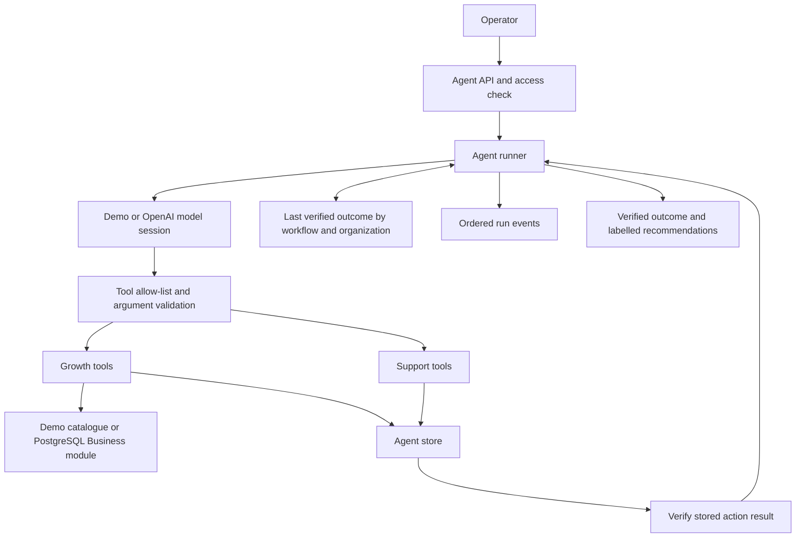

# Shared agent system design

## Purpose

Implement the supplied Week 1 agent design in the existing .NET solution, supporting business growth and incident support through a common runner. This increment provides executable workflows, validated actions, persistent outcomes, and deterministic tests. Python/FastAPI suggestions in the source design are translated into the repository's C#/ASP.NET Core stack.

## Components

`Agents` depends on an `IBusinessCatalog` interface. The API composition layer supplies either sample records or a PostgreSQL adapter, so the runner does not depend on EF or business infrastructure. `Agents:CatalogSource` selects the data source independently of `Agents:Mode`. Business endpoints create/list/read organizations and products, and PostgreSQL enforces the product-to-organization foreign key.

## Workflows

### Business growth

Read the organization, read at most 100 products in deterministic order, retrieve guidance, optionally save one draft per run, and verify its existence before reporting completion. Plans contain proposed experiments rather than measured results. Publishing campaigns and sending messages are outside this workflow.

### Incident support

Read a ticket belonging to the selected organization, retrieve the support procedure, evaluate the permitted transition, and update only with explicit run write permission. A recovered-service ticket with a positive stored health signal may be marked resolved. Other open incidents must be escalated. Ticket version checks reject stale updates. Re-read the updated ticket before completion. Already closed tickets can be reviewed without a second update.

## Execution and controls

1. Validate the workflow, organization identifier, task length, and ticket identifier.
2. Persist the run ID, task, mode, and start time.
3. Load the previous verified outcome for the exact organization/workflow/ticket scope.
4. Give the model the instructions, allowed tools, task, and current observations.
5. Accept exactly one tool decision, validate its name and complete argument shape, then execute it.
6. Persist the observation and audit event; repeat within the deadline and step budget.
7. Validate required evidence and recheck saved results before setting a completed outcome.
8. Save only the verified outcome as cross-run memory. On error, stop with an explicit terminal state.

Write permission comes from the operator's request, not model-generated arguments. Tools obtain organization and ticket identifiers from the validated run, so the model cannot redirect them by supplying IDs. Both tool schemas and runtime validation reject unknown or duplicated fields. Knowledge and record contents are treated as data in the system instructions; this reduces prompt-injection risk but is not a formal guarantee. Independent action checks remain mandatory.

Requests are limited to 64 KB. Concurrent runs are limited to four per process; excess calls receive HTTP 429. Runs are synchronous and have a default 120-second deadline and 12-decision limit. There is no queue or resumable worker yet.

## Model integration

`Demo` is a fixed workflow simulator using the selected sample or database catalogue. It validates the plumbing and does not satisfy the assessment's autonomous model-selection criterion by itself. `OpenAI` implements actual iterative function calling with a configured model and key. The HTTP adapter replays tool calls, outputs, and encrypted reasoning context in memory with `store=false`. The persisted audit contains public instructions, task inputs, requested tools, validated arguments, outputs, errors, and timestamps; it does not store hidden chain-of-thought.

The final status and action summary come from server-side verification. The model supplies a separate recommendation. Schema validation cannot establish semantic truth for arbitrary generated advice, so recommendations and draft plans require review.

## Data and storage

| Record | Storage and scope |
|---|---|
| Organization/product | PostgreSQL Business schema or fixed sample catalogue, selected independently of model mode. |
| Run and events | One JSON file per UUID, rewritten atomically after every event. |
| Growth plan | One JSON file per run; repeated calls in that run return the original plan. |
| Ticket | One JSON file per organization and validated ticket ID, with versioned transitions. |
| Memory | Latest verified outcome per organization, workflow, and optional ticket ID. |

The local store is designed for one process and bounded demonstration data. Its in-process lock prevents conflicting writes inside that process. It is not a distributed lock, a transactional event store, or a multi-tenant authorization system. Startup changes unfinished runs to `interrupted`; it never resumes their actions automatically. Keep demo and live data in separate configured directories.

## Verification and remaining work

Automated tests exercise growth draft persistence, support recovery/escalation, read-only runs, invalid tool requests, prerequisite enforcement, failure termination, memory isolation, step limits, cancellation, concurrent version conflicts, restart handling, and the live provider wire contract.

Product intake and database-backed growth integration are implemented, with an isolated PostgreSQL API test suite. The next increments are PostgreSQL-backed agent storage, request idempotency, per-user organization authorization, product editing, external ticket/health adapters, stronger evidence-based output evaluation, configurable knowledge and retention, and a frontend. Live provider verification needs configured credentials. Multi-replica deployment and production readiness are not claimed by this increment.
